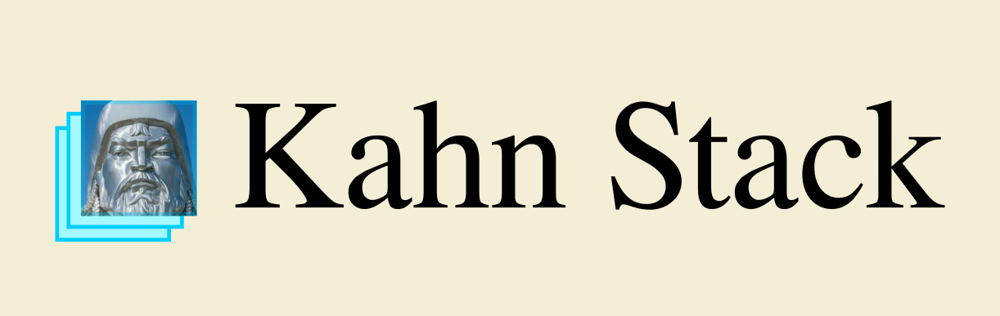

# Kahn Stack

---



---

Backend

- Django ORM
- Django Rest Framework
- Django AllAuth
- Dynamic Rest
- API Client Codegen

Frontend

- [WEB] Sveltekit Min | Sveltekit + Shadcn | Nextjs + Mantine
- [iOS/Android] Expo

Deployment

- Kamal
- Pulumi
- Secrets Management
- Deployment Config Codegen

## Quickstart

```sh
curl -LO https://github.com/b93de3d/kahn-stack/blob/master/bootstrap.sh
sh bootstrap.sh myproject
cd myproject
kahn version
```

The `templates` directory contains starter templates for various project components:

- `django_backend` the core system [REQUIRED]
- `svelte_frontend_min` a minimal svelte + sveltekit frontend
- etc.

Each component exposes a `kahn_setup.sh` script that is run once after the template has been copied into place

- Install dependencies (pip install, yarn install etc.)
- Put in place config files (config.json, .env.development etc.)
- Run migrations or any other setup scripts

Each component is also going to need to include a snippet for inclusion in the main Dockerfile for the project

Each component will need to include information about how it is run by kamal

A single file that captures all of this might be a good idea


